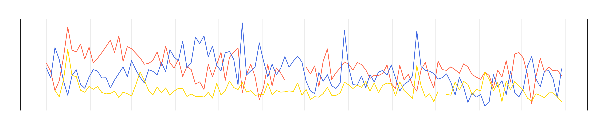

<div align="center">


## **ukaq**
### a dependency-free way to access uk air quality data

<!-- badges: start -->
[](https://github.com/openair-project/ukaq/actions)
[](https://CRAN.R-project.org/package=ukaq)
<br>
[](https://github.com/openair-project/ukaq)
[](https://openair-project.github.io/ukaq/)
[](https://openair-project.github.io/book/)
<!-- badges: end -->

</div>

**ukaq** is an R package for accessing air quality monitoring data from the United Kingdom. It is designed to be lightweight and low-dependency, making it useful for a wide range of users, including those working in resource-constrained environments or seeking seamless integration into existing workflows without the overhead of installing numerous additional packages.

<div align="center">

*Part of the openair toolkit*

[](https://openair-project.github.io/openair/) | 
[](https://openair-project.github.io/worldmet/) | 
[](https://openair-project.github.io/openairmaps/) | 
[](https://openair-project.github.io/deweather/)

</div>

<hr>

## 💡 Core Features

**ukaq** has a small number of core functions.

- **Flexible access to metadata** from several hundred UK air pollution monitoring sites through `import_ukaq_meta()`.

- **Straightforward importing of hourly data** with controls for start and end dates, pollutants of interest, and flexibly appending site metadata.

- **Access to a myriad of pre-calculated statistics** including daily, monthly, and annual averages, as well as statistics aligned with the UK Daily Air Quality Index.

<div align="center">

</div>

<hr>

## 📖 Documentation

All **ukaq** functions are fully documented; access documentation using R in your IDE of choice.

```r
?ukaq::import_ukaq_meta
```

Documentation is also hosted online on the **package website**.

[](https://openair-project.github.io/ukaq/)

A guide to the openair toolkit can be found in the **online book**, which contains lots of code snippets, demonstrations of functionality, and ideas for the application of **openair**'s various functions.

[](https://openair-project.github.io/book/)

<hr>

## 🗃️ Installation

You can install the development version of **ukaq** from GitHub using `{pak}`:

``` r
# install.packages("pak")
pak::pak("openair-project/ukaq")
```

<hr>

🏛️ **ukaq** is primarily maintained by [Jack Davison](https://github.com/jack-davison).

📃 **ukaq** is licensed under the [MIT License](https://openair-project.github.io/ukaq/LICENSE.html).

🧑‍💻 Contributions are welcome from the wider community. See the [contributing guide](https://openair-project.github.io/ukaq/CONTRIBUTING.html) and [code of conduct](https://openair-project.github.io/ukaq/CODE_OF_CONDUCT.html) for more information.
